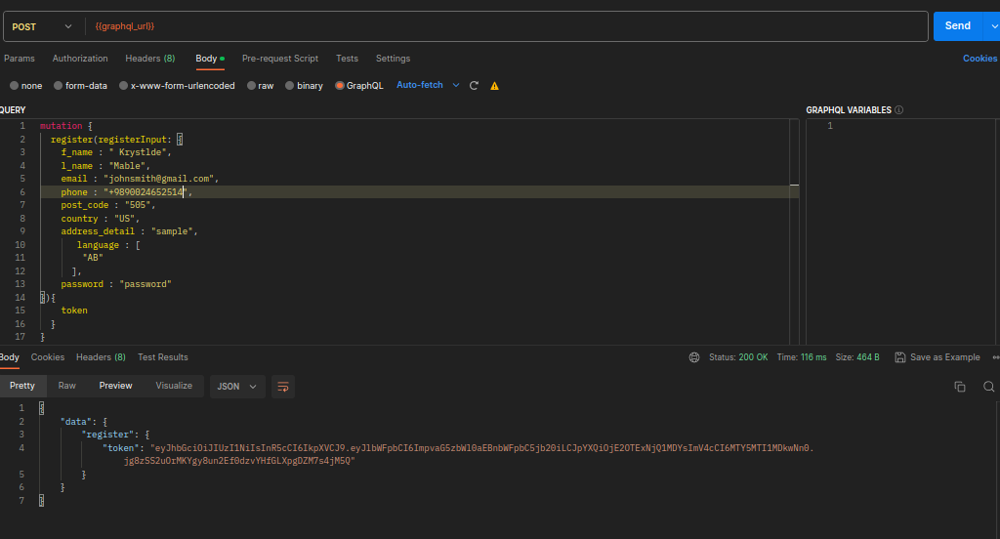
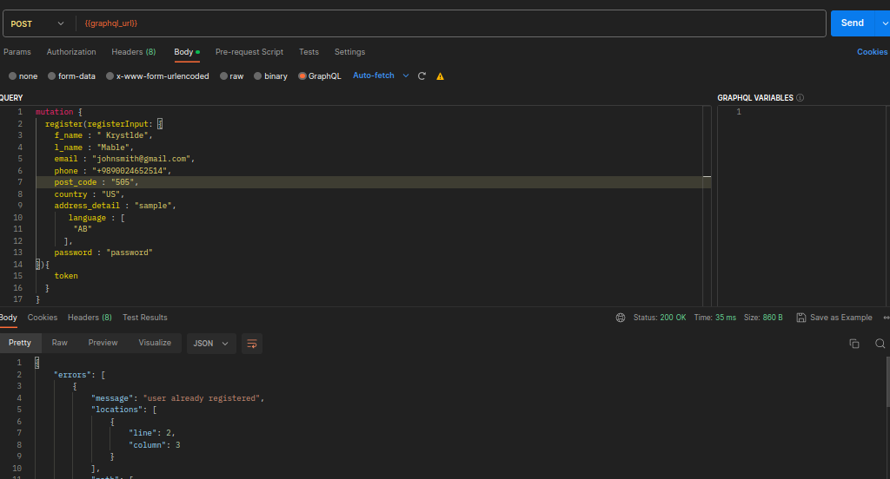
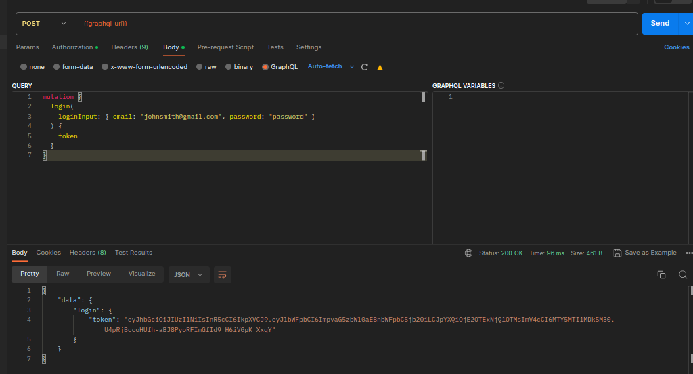
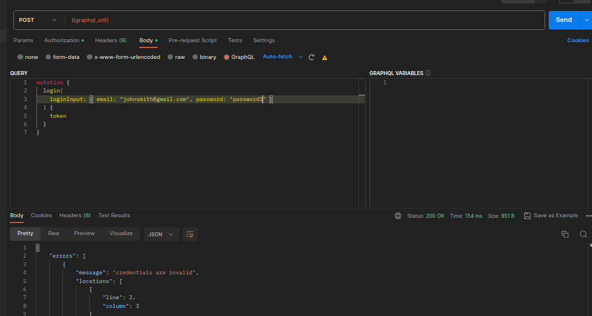
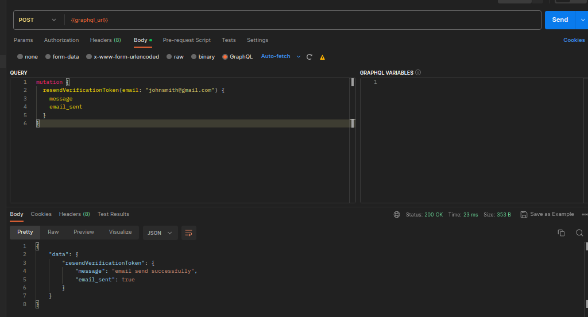
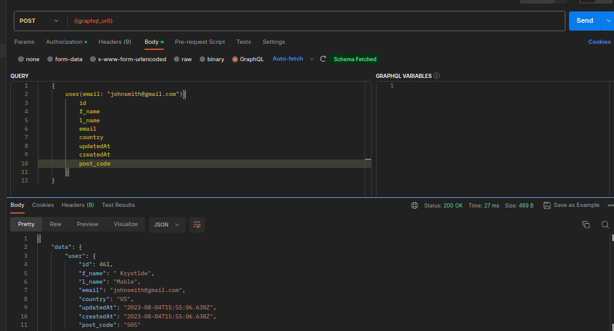
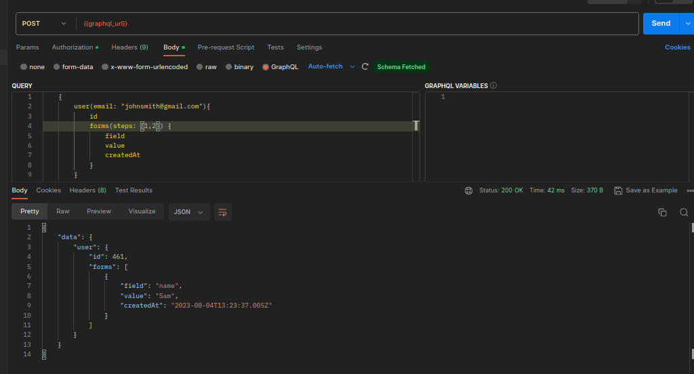
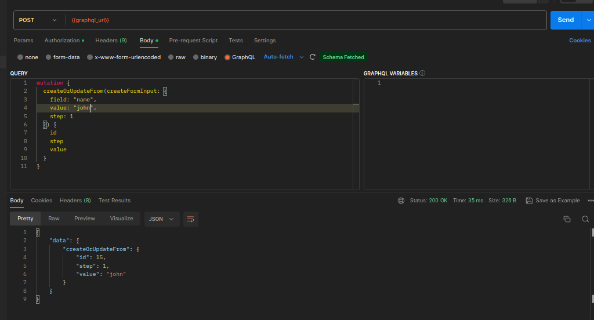
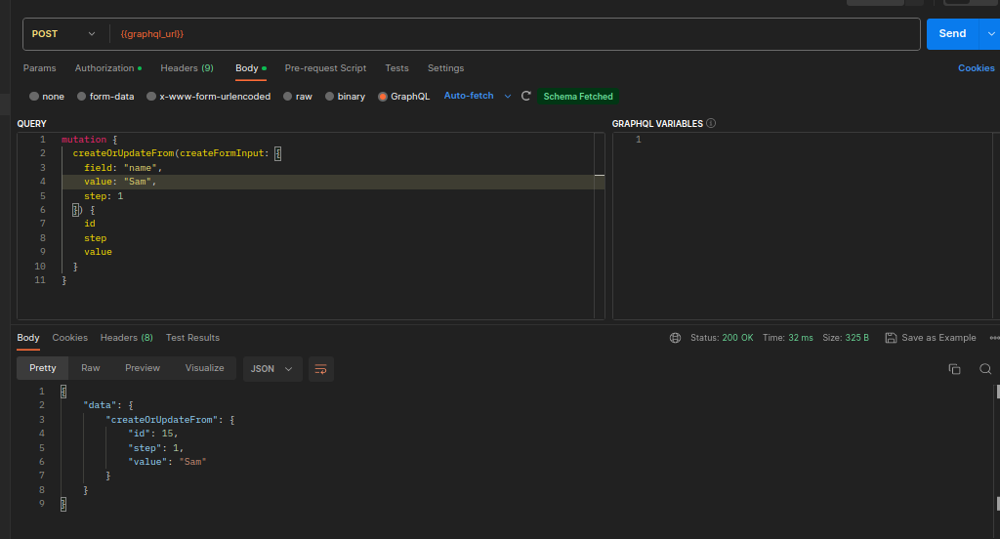

# Onboarding GraphQL TS

This is a sample application that demonstrates a multi-step registration process using GraphQL and NestJS.

## Features

- User Management
  - Registration
  - Login
  - Email Verification
  - Authentication & Authorization
- Form
  - Set Forms For Each Step Of Registration
  - Update Forms
  - Retrieve Form For Step(s)
- Files
  - Upload File(s) For Each Form
  - Update File(s) For Each Form
  - Delete FIle(s) For Each Form

## Technologies Used

This project uses the following technologies:

- **GraphQL**: GraphQL is a query language for APIs and a runtime for executing queries with your existing data. It provides a more efficient and flexible alternative to traditional REST APIs.

- **NestJS**: NestJS is a progressive Node.js framework for building efficient, scalable, and reliable server-side applications. It is built with TypeScript and leverages modern JavaScript features and design patterns.

- **PostgreSQL**: PostgreSQL is a powerful and open-source relational database management system. It offers scalable, reliable, and high-performance storage for your application's data.

- **Prisma**: Prisma is an open-source database toolkit that simplifies database access and management. It provides an intuitive API for database queries, migrations, and schema management.

- **Apollo Server**: Apollo Server is a GraphQL server implementation for Node.js. It allows you to build GraphQL APIs with ease, providing features like schema generation, resolvers, and data fetching.

- **JWT (JSON Web Tokens)**: JWT is an open standard for securely transmitting information between parties as a JSON object. It is commonly used for authentication and authorization purposes in web applications.

- **Jest**: Jest is a JavaScript testing framework that is widely used for testing JavaScript applications, including NestJS projects. It provides a simple and intuitive API for writing unit tests, integration tests, and end-to-end tests.

## Installation

1. Clone the repository:

   ```bash
   git clone https://github.com/BaseMax/OnboardingGraphQLTS.git
   ```

2. Navigate into the project directory:

   ```bash
   cd OnboardingGraphQLTS
   ```

3. Install the dependencies:

   ```bash
   npm install
   ```

4. Set up your PostgreSQL database and update the database connection settings in the `.env` file(use `.env.sample`).

5. Run the migration to create the database tables:

   ```bash
   npx prisma migrate dev
   ```

6. Start the server:

   ```bash
   npm run start:dev
   ```

7. The app will now be running at `http://localhost:3000`.

## Testing

This project includes unit tests and integration tests for the backend functionality.

To run the tests, use the following command:

```bash
npm test
```

Jest will execute all the tests and display the results.

## Demo











## Graphql Schema ,Queries and Mutations

You can get full Graphql file schema in `/src/schema.gql` file

### Queries

- user
  Fetch user and his/her forms
- isPhoneExist
  return true if user with this phone exists
- isEmailExist
  return true if user with this email exists email exists

```graphql
type Query {
  user(email: String, phone: String): User
  isEmailExist(email: String!): Boolean!
  isPhoneExist(phone: String!): Boolean!
}
```

### Mutations

- register
  register user with correct credentials `RegisterInput`
- login
  login to account with correct credentials `LoginInput`
- resendVerification
  resend email to unverified user
- createOrUpdateForm
  create or update form with `createFormInput` input

```graphql
type Mutation {
  register(registerInput: RegisterInput!): AuthToken!
  login(loginInput: LoginInput!): AuthToken!
  resendVerificationToken(email: String!): EmailMessage!
  createOrUpdateFrom(createFormInput: CreateFormInput!): Form!
}
```

### Types

- Form
  user form type for each step of registration
- User
  user model with account information
- AuthToken
  output type for register/login mutation
- Email Message
  output type for resendEmailVerification mutation

```graphql
type Form {
  id: Int!
  step: Int!
  userId: Int!
  field: String!
  value: String!
  createdAt: DateTime!
  updatedAt: DateTime!
}

type User {
  id: Int!
  f_name: String!
  l_name: String!
  email: String!
  phone: String!
  post_code: String!
  country: String!
  address_detail: String!
  email_verified: Boolean!
  languages: [String!]!
  createdAt: DateTime!
  updatedAt: DateTime!
  forms(steps: [Int!]!): [Form!]!
}

type AuthToken {
  token: String!
}

type EmailMessage {
  message: String!
  email_sent: Boolean!
}
```

### Inputs

- RegisterInput
  register input (register dto) for register mutation
- LoginInput
  login input (login dto) for login mutation
- CreateFormInput
  create form input (form dto) for each step form

```graphql
input RegisterInput {
  f_name: String!
  l_name: String!
  email: String!
  phone: String!
  password: String!
  post_code: String!
  country: String!
  address_detail: String!
  language: [String!]!
}

input LoginInput {
  email: String!
  password: String!
}

input CreateFormInput {
  field: String!
  value: String!
  step: Int!
}
```

## Documentation

Feel free to check `onBoardGraphQLTS.postman_collection.json` file and import it into your Postman.

Copyright 2023, Max Base
